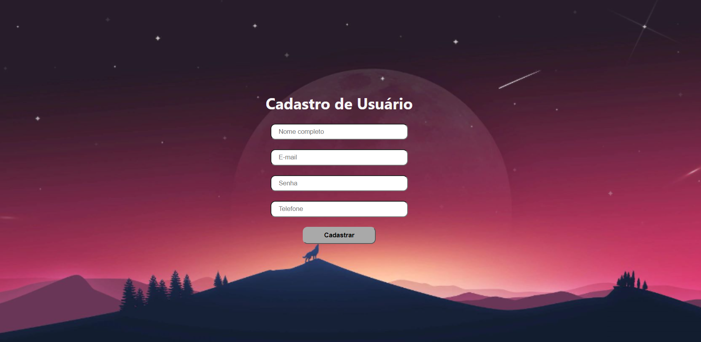

# Login-Set-Spring-Boot - Frontend

Este repositório contém a parte frontend da aplicação de autenticação de usuário **Login-Set-Spring-Boot**, desenvolvida com **React JS**. A aplicação se comunica com o backend (disponível em outro repositório) que foi desenvolvido com **Java Spring Boot** e **MySQL**.



## Funcionalidades

- Formulário de cadastro de novos usuários
- Formulário de login
- Validação de campos do formulário
- Comunicação com o backend via API utilizando **Axios**
- Armazenamento e utilização de **JWT (JSON Web Token)** para autenticação
- Navegação entre as páginas com **React Router**

## Tecnologias Utilizadas

- **React JS**
- **Axios** para chamadas HTTP
- **React Router** para navegação
- **CSS** para estilização (ou **Bootstrap**, caso esteja usando)

## Configuração do Projeto

1. Clone este repositório:
   ```bash
   git clone https://github.com/usuario/Login-Set-Spring-Boot-Frontend.git

2. Dependências do repositório:
  ```
   npm install
